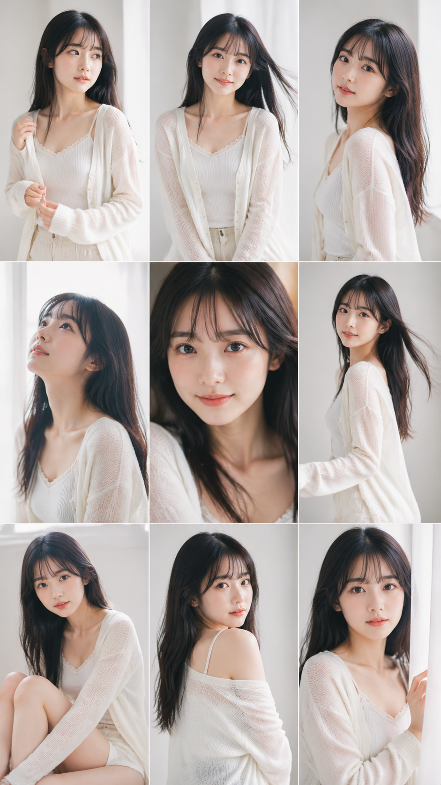

# GPT-Image-2 Skill

使用 GPT-Image-2 API 生成图片，支持通用 prompt、模板生成、编辑、局部重绘和多图合成。

## 模板预览

<table>
<tr>
<td align="center"><br><b>Cosplay 角色海报</b></td>
<td align="center"><br><b>Video Pitch Deck</b></td>
<td align="center"><br><b>人像摄影</b></td>
</tr>
<tr>
<td align="center"><br><b>情侣双人写真</b></td>
<td align="center"><br><b>K-pop 偶像写真</b></td>
<td align="center"><br><b>街头摄影</b></td>
</tr>
<tr>
<td align="center"><br><b>卧室镜自拍</b></td>
<td align="center"><br><b>人物写真 3x3</b></td>
<td align="center"><br><b>动漫少女与真人约会拼贴 3x3</b></td>
</tr>
</table>

## 项目结构

```text
gpt-image-2-skill/
├── README.md
├── SKILL.md
├── generate.py
├── config.json.example
├── docs/
│   ├── README.md
│   ├── basic.md
│   └── advanced.md
├── prompts/
│   ├── README.md
│   ├── 学院纯欲风.md
│   └── 福利姬-中文模板.md
├── template/
│   ├── poster-cosplay/
│   ├── video-pitch/
│   ├── portrait-photography/
│   ├── couple-portrait/
│   ├── kpop-idol/
│   ├── street-photography/
│   ├── bedroom-mirror-selfie/
│   ├── person-photoshoot-3x3/
│   └── anime-girl-and-man-date-photo-collage-3x3/
└── example/
```

### 目录说明

- `generate.py`：通用 CLI 入口，负责 API 调用、模板加载、history 保存和输出分流。
- `config.json.example`：公开示例配置；复制为 `config.json` 后填写自己的 endpoint 和 key。
- `docs/`：基础与进阶用法说明。
- `prompts/`：风格化 prompt 素材库与使用说明。
- `template/<name>/`：每个模板的独立目录，包含 `template.json`、`builder.py`、`run.py` 和对应 README。

## 快速开始

### 1. 准备配置

复制示例配置并填写自己的 endpoint：

```bash
cp config.json.example config.json
```

最小示例：

```json
{
  "endpoints": [
    {
      "name": "your-provider",
      "url": "https://your-api.example/v1",
      "model": "gpt-image-2",
      "key": "sk-your-key",
      "priority": 1,
      "timeout": 500,
      "enabled": true,
      "post_max_size": "1440x2560",
      "design_max_size": "1440x2560"
    }
  ],
  "default_model": "gpt-image-2",
  "retry_count": 1,
  "output_dir": "~/.hermes/output/gpt-image-2"
}
```

### 2. 通用生成

```bash
python3 generate.py \
  --prompt "一位优雅的少女站在樱花树下，日系风格" \
  --size 1024x1536 \
  --quality high
```

### 3. 使用模板

```bash
python3 template/poster-cosplay/run.py \
  --vars '{"xxx":"莎赫拉查德 Code S from Brown Dust 2"}' \
  --output poster.png

python3 template/portrait-photography/run.py \
  --vars '{"model_name":"日系少女"}' \
  --output portrait.png

python3 template/video-pitch/generate_pitchdeck.py \
  --vars '{"title":"项目名称","subtitle":"副标题"}' \
  --prefix my-pitch
```

## 配置说明

### `config.json`

| 字段 | 说明 |
| --- | --- |
| `endpoints` | endpoint 列表，按 `priority` 从小到大选择 |
| `default_model` | 默认模型名 |
| `retry_count` | 每个 endpoint 的重试次数 |
| `output_dir` | 输出根目录；模板和通用生成都会在该目录下分流 |

### 每个 endpoint 的字段

| 字段 | 说明 |
| --- | --- |
| `name` | endpoint 名称 |
| `url` | API 根地址 |
| `model` | 模型名，当前默认 `gpt-image-2` |
| `key` | API key |
| `priority` | 数字越小优先级越高 |
| `timeout` | 单次请求超时秒数 |
| `enabled` | 是否启用 |
| `post_max_size` | 非 `video-pitch` 模板的默认尺寸 |
| `design_max_size` | 通用生成和 `video-pitch` 的默认尺寸 |

### 多 endpoint 行为

- 只会使用 `enabled: true` 的 endpoint。
- 请求按 `priority` 顺序尝试。
- 如果前一个 endpoint 失败，会自动回退到下一个。
- `--timeout` 只覆盖当前命令，不会修改 `config.json`。

## 尺寸规则

这是当前代码中的实际规则：

- 显式传入 `--size` 时，始终以 `--size` 为准。
- 未传 `--size` 时：
  - `generate.py` 默认使用当前最高优先级 endpoint 的 `design_max_size`。
  - `video-pitch` 默认使用当前最高优先级 endpoint 的 `design_max_size`。
  - 其他模板默认使用当前最高优先级 endpoint 的 `post_max_size`。

### 尺寸校验

`generate.py` 会校验以下约束：

- 宽高建议为 16 的倍数。
- 长宽比不得超过 3:1。
- 总像素需在 `655,360` 到 `8,294,400` 之间。
- 最大边达到或超过 `3840` 时会给出 warning。

## CLI 概览

### `generate.py`

```bash
python3 generate.py [options]
```

常用参数：

| 参数 | 说明 |
| --- | --- |
| `--prompt` | 通用 prompt；使用模板时可省略 |
| `--template` | 模板名 |
| `--vars` | 模板变量 JSON |
| `--list-templates` | 列出所有模板 |
| `--mode` | `generate` / `edit` / `composite` / `inpaint` |
| `--size` | 输出尺寸 |
| `--quality` | 当前仅支持 `high` |
| `--n` | 生成数量，1 到 4 |
| `--output` | 输出文件名；相对路径会落到对应 output 子目录 |
| `--timeout` | 本次请求超时 |
| `--image` | edit/composite 模式的输入图，多个用逗号分隔 |
| `--mask` | inpaint 模式的蒙版图 |

### 常见模式

```bash
python3 generate.py --mode edit \
  --image photo.png \
  --prompt "Change only the pose. Keep everything else the same."

python3 generate.py --mode composite \
  --image img1.png,img2.png \
  --prompt "Put the accessory from Image 1 onto the subject in Image 2."

python3 generate.py --mode inpaint \
  --image photo.png \
  --mask mask.png \
  --prompt "In the masked area, generate a red dress."
```

## 模板入口

每个模板目录都提供固定入口 `template/<name>/run.py`，不需要再传 `--template`。

| 模板 | 入口 | 说明 |
| --- | --- | --- |
| `poster-cosplay` | `template/poster-cosplay/run.py` | Cosplay 海报 |
| `video-pitch` | `template/video-pitch/run.py` | 单张 pitch 页面 |
| `portrait-photography` | `template/portrait-photography/run.py` | 单人人像摄影 |
| `couple-portrait` | `template/couple-portrait/run.py` | 双人写真 |
| `kpop-idol` | `template/kpop-idol/run.py` | K-pop 偶像概念照 |
| `street-photography` | `template/street-photography/run.py` | 街头摄影 |
| `bedroom-mirror-selfie` | `template/bedroom-mirror-selfie/run.py` | 卧室镜自拍 |
| `person-photoshoot-3x3` | `template/person-photoshoot-3x3/run.py` | 同人物九宫格 |
| `anime-girl-and-man-date-photo-collage-3x3` | `template/anime-girl-and-man-date-photo-collage-3x3/run.py` | 二次元少女 + 真人男性九宫格 |

`video-pitch` 额外提供：

- `template/video-pitch/generate_pitchdeck.py`：生成 3 张 panel，并可自动拼接。
- `template/video-pitch/combine_panels.py`：把已有 panel 图片拼成一张大图。

## 输出与 history

### 输出目录

默认输出根目录来自 `config.json.output_dir`；如果未配置，默认值为：

```text
~/.hermes/output/gpt-image-2
```

在该目录下按用途分流：

- 通用生成：`normal/`
- 模板生成：`<template-name>/`

示例：

```text
~/.hermes/output/gpt-image-2/normal/20260503-101500.png
~/.hermes/output/gpt-image-2/poster-cosplay/poster.png
~/.hermes/output/gpt-image-2/video-pitch/my-pitch-panel-1.png
```

### history 目录

history 永远保存在仓库内：

- 通用生成：`history/`
- 模板生成：`template/<template-name>/history/`

示例：

```text
history/20260503-101500.json
template/poster-cosplay/history/20260503-101620.json
```

## Prompt 素材库

`prompts/` 目录提供可复用的风格化 prompt 素材，适合人物写真类任务。

| 文件 | 说明 |
| --- | --- |
| `prompts/README.md` | 索引、选型方法和安全写法 |
| `prompts/学院纯欲风.md` | 学院、清纯、古风、居家等风格元素与英文模板 |
| `prompts/福利姬-中文模板.md` | 更偏性感与情绪化表达的中文模板 |

使用建议：

1. 先读 `prompts/README.md`。
2. 选一个风格文件读取元素。
3. 再决定是直接走 `generate.py --prompt`，还是映射到某个模板的 `--vars`。

## 发布前不要提交的文件

以下内容应保持在 `.gitignore` 中，发布时不要提交：

- `config.json`：本地 endpoint、API key 和私有配置。
- `history/` 与 `template/*/history/`：生成历史记录。
- Python 缓存文件：`__pycache__/`、`*.pyc`。

如果你要对外发布配置，请只提交 `config.json.example`，不要提交真实 key。

## 更多说明

- `docs/basic.md`：通用 prompt 与基础模式建议。
- `docs/advanced.md`：多图、编辑、局部重绘等进阶用法。
- `SKILL.md`：面向 Claude Skill/自动化调用的说明。